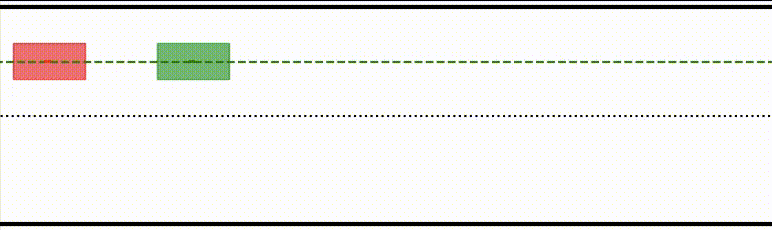
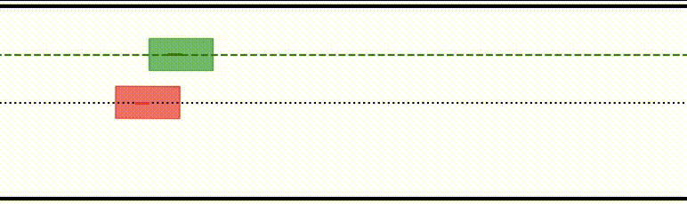

# iLQR

- Iterative Linear Quadratic Regulator (iLQR) for non-linear trajectory optimization.
- Supports inequality constraints on control inputs or state variables via barrier functions.
- with [Numba](https://numba.pydata.org) acceleration - 20x faster than native python code.

#### Dependencies
- sympy, numpy, numba, matplotlib

#### [vehicle control example](./examples/vehicle_control.py)



## Usage
```python
from ilqr import iLQR
from ilqr.containers import Dynamics, Cost
```
See [examples](./examples) folder for more insight on how to use this repo.

### Construting Dynamics
- You can either define dynamics numerically or symbolically and pass it to the 'Dynamics Container' class.
- Look at [containers.py](./ilqr/containers.py) file in source code for more insight into construting the dynamics and cost.

Let's consider a simple problem i.e. pushing a box to goal position from start (double integrator system). The dynamics are defined as
```
s" = u/mass
```
#### Finite Diff Dynamics
Partial derivatives are computed using Finite Difference approximation.
```python
import numpy as np
from ilqr.containers import Dynamics

# params
m  = 2.0 # mass
dt = 0.1 # discrete time step
#numerical function
def f(x, u):
  #velocity
  vel = x[1]
  #acceleration
  acc = u[0]/m
  #construct state_dot
  x_dot  = np.array([vel, acc])
  return x_dot

#contruct Dynamics
dynamics = Dynamics.Continuous(f, dt)
```

#### Symbolic Dynamics
Partial derivatives are computed symbolically using sympy and compiled with Numba.
```python
import sympy as sp
from ilqr.utils import GetSyms
from ilqr.containers import Dynamics

#state and action dimensions
n_x = 2
n_u = 1

#params
m  = 2.0
dt = 0.1
#Get Symbolic variables
x, u = GetSyms(n_x, n_u)
#Construct Discrete dynamics
x_n  = x + sp.Matrix([x[1], u[0]/m])*dt
dynamics = Dynamics.SymDiscrete(x_n, x, u)
```
Note: You can also directly construct dynamics by hard coding the partial derivaties and wrapping them with numba.jit decorator.
```python
def f(x, u): ...
def f_x(x, u): ...
def f_u(x, u): ...
dynamics = Dynamics(f, f_x, f_u)
```

#### usage
```python
>>> dynamics.f(x0, u0)
>>> dynamics.f_x(x0, u0)
>>> dynamics.f_u(x0, u0)
```

### Construting Cost
- Similar to the dynamics, the partial derivates of the cost functions are computed by the 'Cost Container'.
- They can also be specified directly as shown above.

Let's construct a simple cost to penalise the box for staying away from goal (i.e S = 10m).
#### Simple cost
```python
import sympy as sp
from ilqr.utils import GetSyms
from ilqr.containers import Cost

x, u = GetSyms(n_x, n_u)

#displacement and velocity
s, v = x
#Terminal cost
Lf = 10*(s - 10)**2
#Running cost
L = (s - 10)**2 + 0.1*v**2 + 0.1*u[0]**2
#construct cost
cost = Cost.Symbolic(L, Lf, x, u)
```
Note: Currently only Symbolic costs are supported
#### Constrain control input or state variable
- Logarithmic and Exponential barrier functions are implemented for adding inequality constraints as cost. Look at [utils.py](./ilqr/utils.py) file for more info.

```python
from ilqr.utils import Bounded

L = (s - 10)**2 + 0.1*v**2
#Running cost with constraint on applied force (2N to -2N)
L += Bounded(u, high = [2], low = [-2])
#construct cost
cost = Cost.Symbolic(L, Lf, x, u)
```

#### Quadratic Cost
```python
import numpy as np
import sympy as sp
from ilqr.utils import GetSyms, Bounded
from ilqr.containers import Cost

x_goal = np.array([10, 0])
Q  = np.diag([1, 0.1])
R  = np.diag([0.1])
QT = np.diag([10, 10])
#construct Quadratic Cost
cost = Cost.QR(Q, R, QT, x_goal)

#Add constraints on Force (2N to -2N)
cons = Bounded(u, high = [2], low = [-2])
#construct Quadratic cost with constraints
cost = Cost.QR(Q, R, QT, x_goal, cons)
```

#### usage
```python
>>> cost.L(x0, u0)
>>> cost.L_x(x0, u0)
>>> cost.L_ux(x0, u0)
    .
    .
>>> cost.Lf(x0)
>>> cost.Lf_xx(x0)
```

### iLQR
```python
from ilqr import iLQR

controller = iLQR(dynamics, cost)

#initial state
x0 = np.array([0, 0])
#initil guess
us_init = np.random.randn(N, n_u)*0.01
#run optimization
xs, us, cost_trace = controller.fit(x0, us_init)
```
Note: The first run is slower since numba has to compile the functions. Some parameters of iLQR controller can customised as per your needs (Look at the code for more info)

#### Let's look at the results
Displacement and Force applied with out constraint on force.


Displacement and Force applied with constraint on force.


You can see that the force does not cross the 2N limit.

### MPC
```python
from ilqr.controller import MPC

mpc = MPC(controller, control_horizon = 1)

#initial state
x0 = np.array([0, 0])

#Prediction Horizon
N = 50
#Initil guess
us_init = np.random.randn(N, n_u)*0.01
mpc.set_initial(us_init)

#get optimal action
us = mpc.control(x0)
#after observing next state
us = mpc.control(x_next)
```

## Future Work
- Add AutoDiff capabilities via [aesara](https://github.com/aesara-devs/aesara)
- Add MuJoCo support via [dm-control](https://github.com/deepmind/dm_control)
- Support for cost to follow given trajectory

## References
- [Synthesis and Stabilization of Complex Behaviors through Online Trajectory Optimization](https://homes.cs.washington.edu/~todorov/papers/TassaIROS12.pdf)
- [Trajectory Optimization - Russ Tedrake](http://http://underactuated.csail.mit.edu/trajopt.html)
